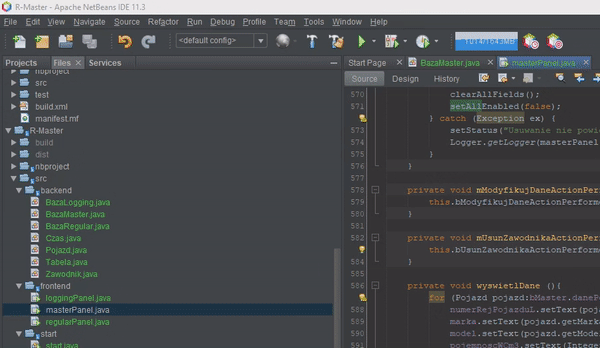
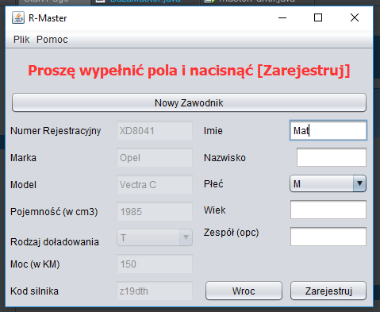
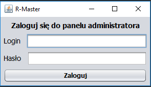
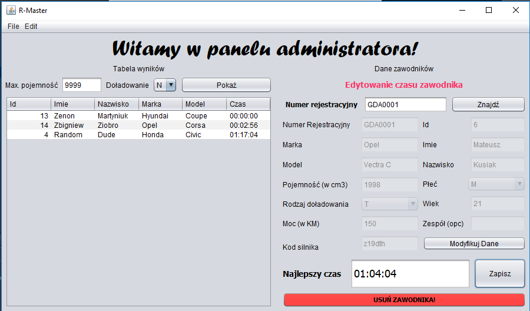

# Aplikacja bazodanowa do motorsportu

> Aplikacja formatkowa napisana w Javie, wykorzystująca baze danych oraz bezpieczne procedury. Aplikacja skupia się na obsłudze zawodów typu rallycross. Zawodnik może zarejestrować siebie i swój pojazd. Osoba uprzywilejowana może zaś zarządzać danymi użytkowników, uzupełniać ich czas oraz wyświetlać posortowaną tabelę wyników.

## Screenshoty
 
Rejestracja zawodnika i samochodu
  
 
Panel logowania użytkownika uprzywilejowanego
  
 
Panel Administratora
  
## Status
Projekt wykonany na zaliczenie przedmiotu ,,Programowanie aplikacji bazodanowych"
## Kontakt
Możesz skontaktować się zemną przez [Email](timax2@wp.pl)
